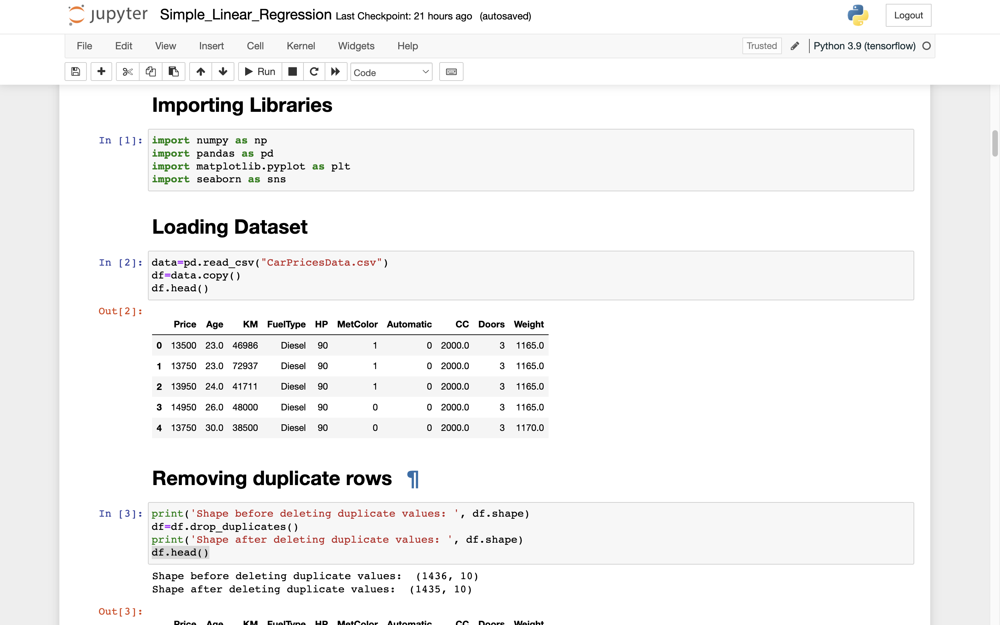
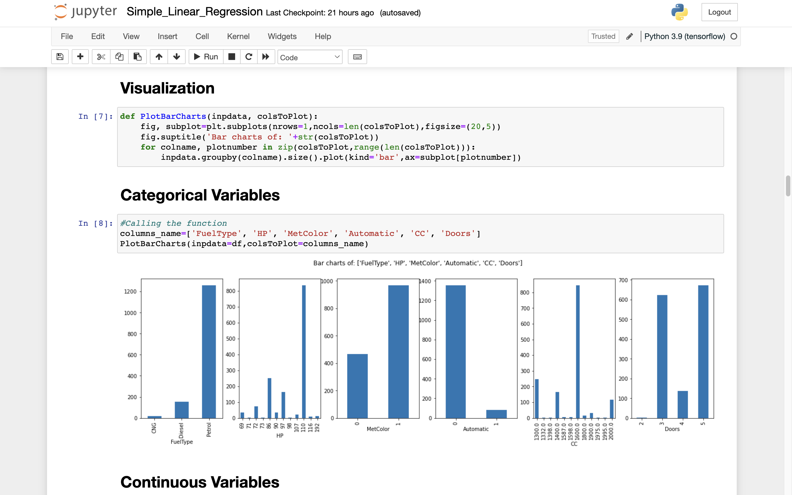
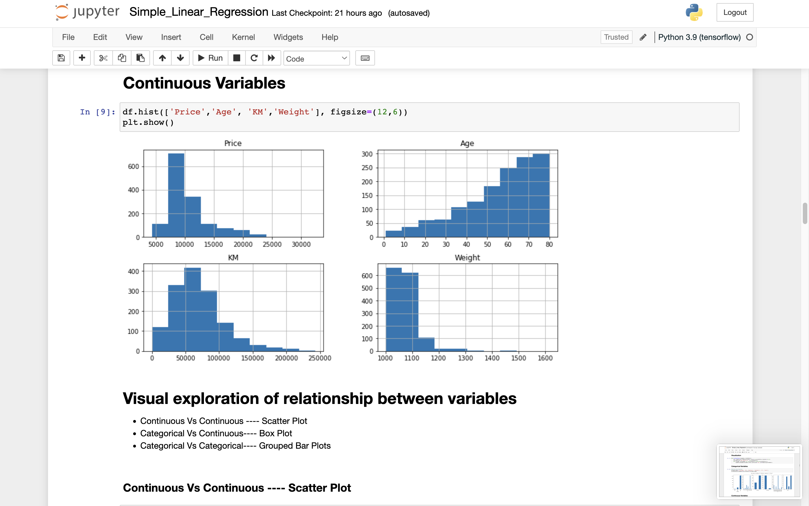
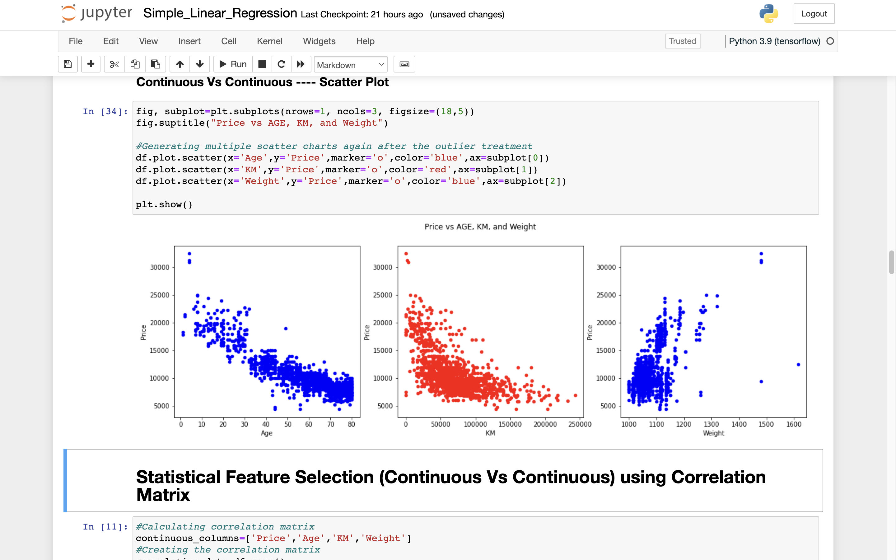
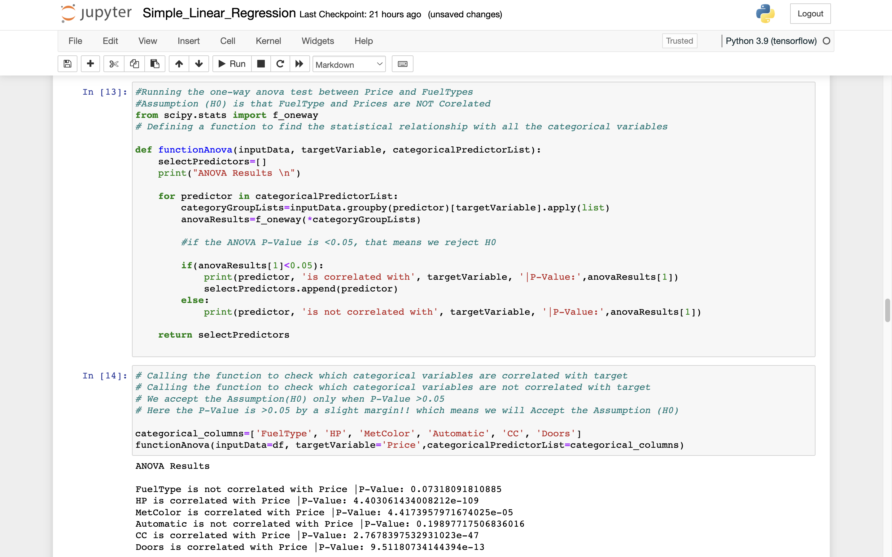
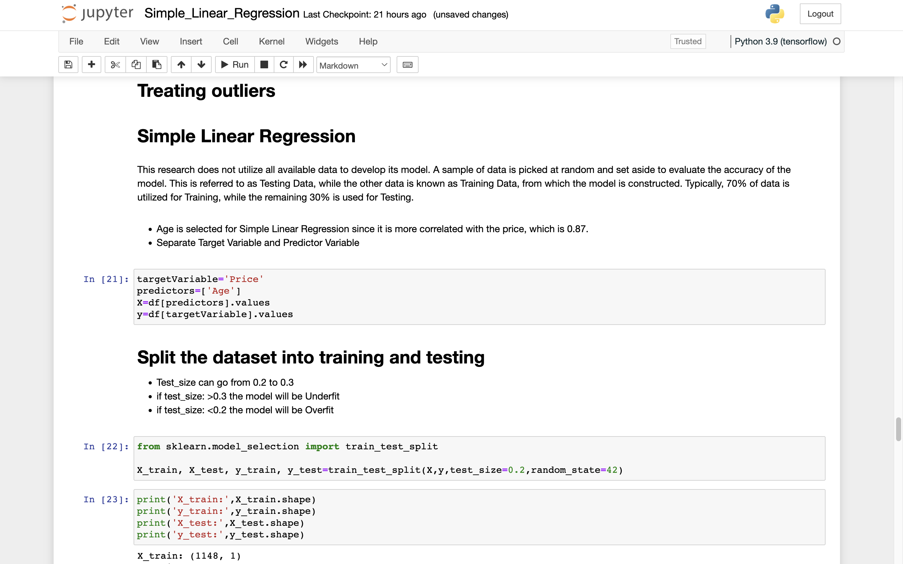
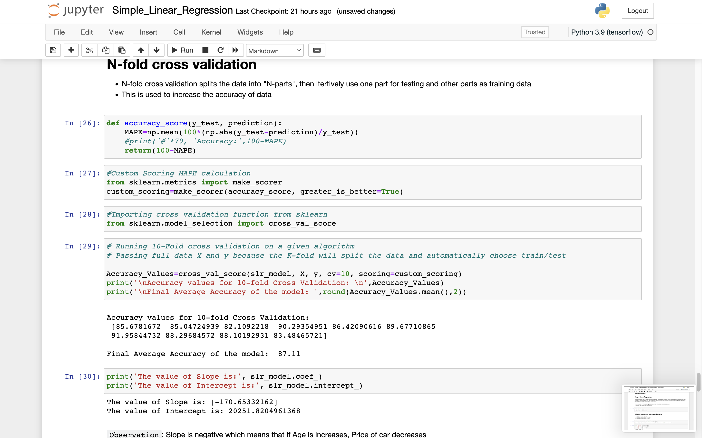
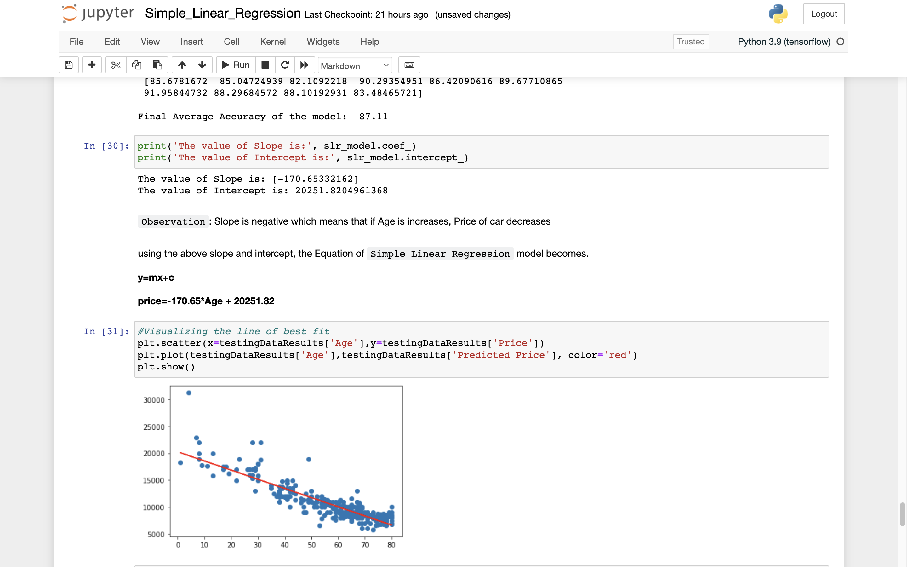
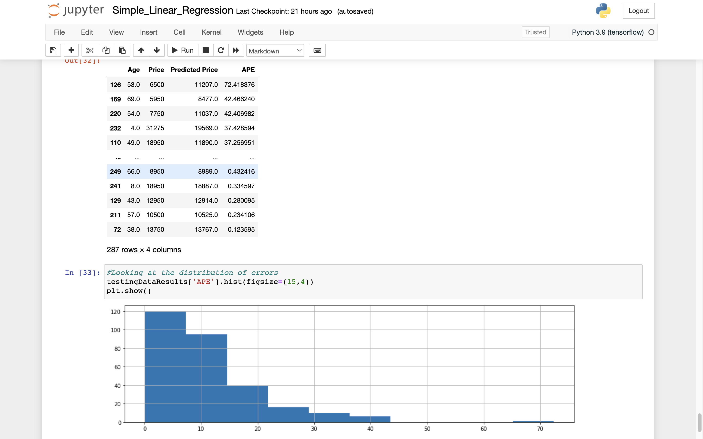

# Simple-Linear-Regression

Linear regression is used for finding linear relationship between target and one or more predictors

There are two types of linear regression:
- Simple and 
- Multiple 

# Simple Linear Regression
Simple linear regression may be used to determine the connection between two continuous variables. One is a predictor or an independent variable, while the other is a reaction or a dependent variable. It seeks a statistical link as opposed to a deterministic one. A deterministic relationship exists between two variables. if one variable can be precisely represented by the other variable. For instance, it is feasible to precisely anticipate Fahrenheit temperatures using Celsius temperatures. In identifying the link between two variables, statistical correlation is inaccurate. Consider the relationship between time and distance, for instance.

### Equation of simple linear regression

y= mx+c

Here,
- y: Target Variable or Dependent variable
- m: Slope of the equation
- x: Independent variable or Predictor
- c: constant

### How do we draw the map?
The fundamental concept is to choose a line that best matches the data. The best-fitting line is the one with the smallest overall prediction error (across all data points). The distance between a point and the regression line called the error.

### Example:
Suppose there is a dataset containing information regarding the correlation between the number of hours spent studying and the grades earned. Several pupils have been monitored, and their study hours and grades have been recorded. This constitutes our training data.

The objective is to develop a model that can predict grades given the amount of hours spent studying. Using the training data, a regression line with least error is determined. The linear equation is then applied to any additional data. Thus, if a student's number of hours of study is entered, our model should predict their grade with little error.

Y(pred) = c+m*x

The values c and m must be selected in order to minimize the mistake. If sum of squared error is used as a measure to assess the model, the objective is to find the line that minimizes error the most. Therefore, in Simple linear regression, the number of iterations is conducted to determine the value of m for which the error (Residue) is the smallest. After m is determined, the slope is drawn, therefore completing the model.

